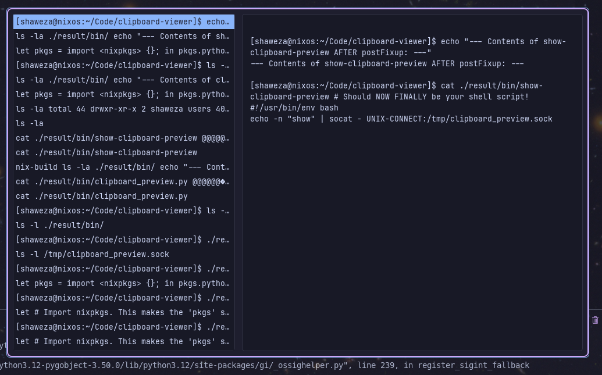
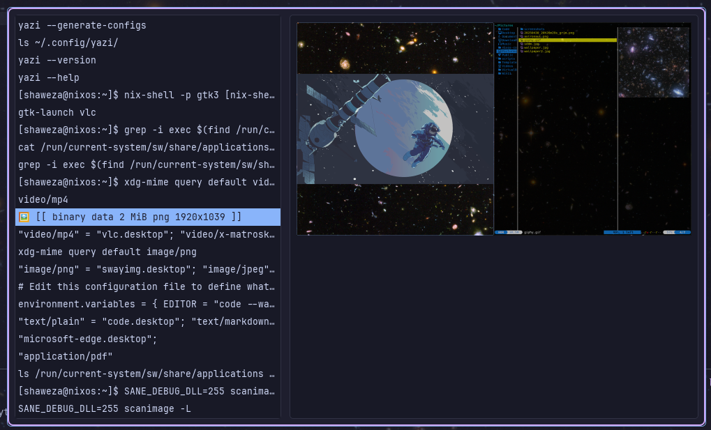

A small script to show your clipboard history as well as a preview of it be it text or image.
Pressing ENTER will put the copied object back into the most recent clipboard.
Pressing ESCAPE will close the window.
You can navigate up and down using both the mouse and the arrow keys

